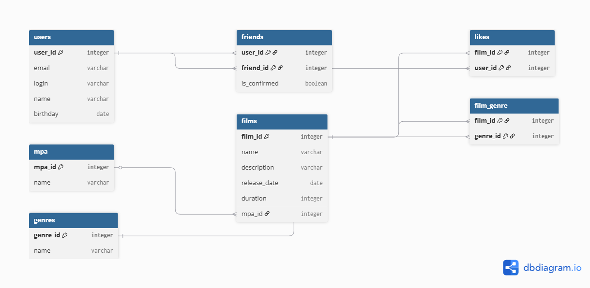

 Filmorate

Приложение для оценки фильмов и поиска друзей по интересам.

## Схема базы данных

### Пояснение к схеме:
База данных спроектирована в соответствии с 3-й нормальной формой:
- **users** и **films**: хранят основные данные пользователей и фильмов.
- **mpa** и **genres**: таблицы-справочники. Так как у фильма может быть только один рейтинг MPA, связь реализована через `mpa_id` в таблице `films` (One-to-Many).
- **film_genre**: связующая таблица для реализации отношения "многие ко многим" между фильмами и жанрами.
- **likes**: связующая таблица для лайков (кто какому фильму поставил).
- **friends**: связующая таблица для дружбы. Поле `is_confirmed` (boolean) показывает статус дружбы (false — заявка отправлена, true — заявка принята).

---